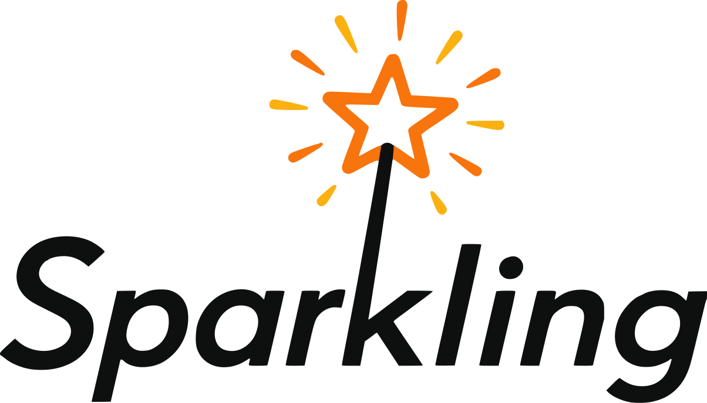

<p align="left">
<picture>
  <source media="(prefers-color-scheme: light)" srcset="images/sparkling-logo-light.svg">
  <source media="(prefers-color-scheme: dark)" srcset="images/sparkling-logo-dark.svg">
  
</picture>
</p>

[](https://github.com/andy327/sparkling/actions/workflows/ci.yml)
[](https://andy327.github.io/sparkling/)
[](https://codecov.io/gh/andy327/sparkling)
[](https://central.sonatype.com/artifact/io.github.andy327/sparkling_2.13)
[](https://spark.apache.org/releases/spark-release-3-5-2.html)
[](https://www.scala-lang.org/)
[](https://opensource.org/licenses/MIT)

Sparkling is a Scala library that wraps Apache Spark's DataFrame API with a fluent, type-safe DSL. It replaces strongly-typed column expressions and verbose `agg()` calls with composable builders for grouping, streaming group operations, and window functions — while staying close enough to Spark that the underlying `DataFrame` is always a `.df` away.

## Getting Started

Add the following to your `build.sbt`:

```scala
libraryDependencies += "io.github.andy327" %% "sparkling" % "0.1.0"
```

Sparkling is published for Scala 2.12 and 2.13. Spark itself is a `provided` dependency — your project is expected to bring its own Spark runtime.

## Word Count

Here is a word count in Sparkling, along with the equivalent raw Spark code.

### Sparkling

```scala
import com.sparkling.dsl._

val wordCounts = lines.frame
  .flatMap("line" -> "word")((s: String) => s.split("\\s+"))
  .groupBy("word") {
    _.count("n")
  }
  .orderBy("n", descending = true)
```

### Raw Spark

```scala
import org.apache.spark.sql.functions._

val wordCounts = lines
  .select(explode(split(col("line"), "\\s+")).as("word"))
  .groupBy("word")
  .agg(count("*").as("n"))
  .orderBy(desc("n"))
```

The single import `com.sparkling.dsl._` brings everything into scope. The `.frame` extension method lifts any Spark `DataFrame` into a `Frame`. From there, all operations stay in the sparkling DSL.

## More Examples

### Basic Transformations

```scala
employees.frame
  .project("id", "name", "dept", "salary")         // keep only these columns
  .rename("dept" -> "department")                  // rename a column
  .filter("salary")(_ >= 50_000)                   // typed predicate
  .map("salary" -> "salary") { (s: Int) => s * 2 } // typed transform
```

### Grouping and Aggregation

`groupBy` returns a `GroupedFrame` builder. Chain aggregations and they all run in a single Spark pass.

```scala
employees.frame
  .groupBy("department") {
    _.count("headcount")
     .avg("salary" -> "avg_salary")
     .max("salary" -> "max_salary")
     .sum("salary" -> "total_salary")
  }
```

For joins and unions:

```scala
// inner join on a shared key
employees.frame.join("dept_id", departments.frame)

// asymmetric keys
orders.frame.join("customer_id" -> "id", customers.frame, JoinType.Left)

// union two frames (pads missing columns with null)
currentMonth.frame ++ lastMonth.frame
```

### Streaming Group Operations

`streamBy` processes each group as a typed iterator, enabling operations that require seeing the whole group at once — like deduplication, sessionization, or custom ranking. The group is optionally sorted before the iterator is handed to your function.

```scala
// keep only the first event per user, by timestamp
events.frame
  .streamBy("user_id") {
    _.sortBy("timestamp")
     .mapGroups("event_type" -> "first_event_type") { iter: Iterator[String] =>
       iter.take(1)
     }
  }
```

For stateful operations, `mapStreamWithContext` threads a per-group value through the iterator:

```scala
// assign sequential positions within each session
events.frame
  .streamBy("session_id") {
    _.sortBy("timestamp")
     .mapStreamWithContext("event_id" -> "position")(init = 0) {
       (counter, iter: Iterator[Long]) =>
         iter.scanLeft(counter)((n, _) => n + 1).drop(1)
     }
  }
```

### Window Functions

`windowBy` returns a `WindowedFrame` builder that accumulates multiple window operations and applies them all in one pass. Rows are never reduced.

```scala
import com.sparkling.frame.WindowBounds._

employees.frame
  .windowBy("department") {
    _.orderBy("salary")
     .rank("dept_rank")                          // rank within dept by salary
     .lag("salary" -> "prev_salary", offset = 1) // salary of the row below
     .sum("salary" -> "running_total")           // running total (default bounds)
  }
```

Custom bounds give you rolling windows or whole-partition aggregates:

```scala
import com.sparkling.frame.WindowBounds
import com.sparkling.frame.WindowBounds._

sales.frame
  .windowBy("region") {
    _.orderBy("sale_date")
     .sum("revenue" -> "rolling_7d",
       bounds = WindowBounds.rowsBetween(-6, currentRow))
     .sum("revenue" -> "pct_of_total",
       bounds = WindowBounds.rangeBetween(unboundedPreceding, unboundedFollowing))
  }
```

`windowAll` applies window functions over all rows as a single partition — useful for global rankings:

```scala
scores.frame
  .windowAll {
    _.orderBy("score", descending = true)
     .rowNumber("global_rank")
  }
```

### Algebird Aggregators

Sparkling integrates with [Twitter Algebird](https://github.com/twitter/algebird) through `GroupedFrame.aggregate`. Any `MonoidAggregator` can be plugged directly into a `groupBy` pipeline. Kryo serialization of opaque buffer types is handled automatically.

```scala
import com.sparkling.algebird.Aggregators

// approximate top-10 items by frequency within each category
val topK = Aggregators.forSpaceSaver[String](capacity = 1000, k = 10)

events.frame
  .groupBy("category") {
    _.aggregate("item" -> "top_items")(topK)
  }
```

Custom aggregators can wrap any `MonoidAggregator` you build with Algebird combinators. If the buffer type is SQL-encodable, Sparkling uses the typed Spark `Aggregator` path directly; if not (e.g. `Option[SpaceSaver[T]]`), it falls back to Kryo-serialized binary buffers automatically.

### Typed Record Mapping

`mapRecord` and `flatMapRecord` decode rows into case classes, apply a typed function, and re-encode the output — all without leaving the `Frame` API.

```scala
case class Employee(name: String, salary: Int)
case class Bonus(name: String, bonus: Int)

employees.frame
  .mapRecord[Employee, Bonus](("name", "salary") -> ("name", "bonus")) { emp =>
    Bonus(emp.name, (emp.salary * 0.1).toInt)
  }
```

## Building and Testing

Sparkling supports Scala 2.12 and 2.13 and requires JDK 17. Spark dependencies are marked `provided`, so you will need a Spark environment at runtime.

```
# compile
sbt compile

# run tests
sbt test

# run the full CI check (lint + format + coverage)
sbt ci
```

Individual test suites can be run with `sbt "testOnly com.sparkling.frame.FrameSpec"`.

Code formatting and import ordering are enforced by [Scalafmt](https://scalameta.org/scalafmt/) and [Scalafix](https://scalacenter.github.io/scalafix/). To auto-format everything before committing:

```
sbt formatAll
```

## License

Copyright 2026 Andres Perez.

Released under the [MIT License](LICENSE).
